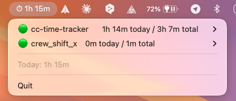

# Claude Code Time Tracker

Automatically tracks time spent in [Claude Code](https://docs.anthropic.com/en/docs/claude-code) sessions per project, using the native hooks system.



## Quick Start

```bash
pip install cc-time-tracker
cc-time-setup
```

That's it. Every Claude Code session is now timed automatically.

## Usage

```bash
cc-time-report              # Default: last 7 days summary + active sessions
cc-time-report summary      # Same as above
cc-time-report today        # Today only
cc-time-report week         # This week (Mon–Sun) with daily breakdown
cc-time-report month        # This month
cc-time-report all          # All time
cc-time-report project X    # Filter by project name (fuzzy)
cc-time-report active       # Show currently running sessions
cc-time-report csv          # Export as CSV (pipe to file)
cc-time-report orphans      # Find sessions that started but never ended
cc-time-report raw          # Raw JSONL dump
cc-time-report --version    # Show version
```

## Example Output

```
Claude Code Time Tracker
Last 7 days  •  47 total sessions recorded

Active Sessions

  ● my-app  1h 23m elapsed  (abc123def45…)
    ~/projects/my-app

Last 7 Days

  Project          Time      Hours  Sessions
  ─────────────  ──────────  ─────  ────────
  my-app           8h 42m    8.70h       12
  api-server       3h 15m    3.25h        8
  landing-page     2h 30m    2.50h        6
  cli-tool         1h 05m    1.08h        4
  ─────────────  ──────────  ─────  ────────
  TOTAL           15h 32m   15.53h       30
```

## How It Works

```
You launch Claude Code in ~/projects/my-app/
  → SessionStart hook fires
  → Records: {session_id, project: "my-app", start_time}

You work for 45 minutes, then /exit
  → SessionEnd hook fires
  → Calculates: 45m 12s
  → Writes completed session to ~/.claude/time-tracking/sessions.jsonl

Meanwhile, another instance is running in ~/projects/api-server/
  → Tracked independently (different session_id)
  → Both durations are summed per-project in reports
```

`cc-time-setup` registers two hooks in `~/.claude/settings.json`:
- **SessionStart** → `python3 -m cc_time_tracker.start_hook`
- **SessionEnd** → `python3 -m cc_time_tracker.end_hook`

Sessions are stored in `~/.claude/time-tracking/sessions.jsonl` (append-only JSONL).

### Project name resolution

For each session, the project name is resolved by walking up from the session's `cwd` (stopping at `$HOME`) and using the first match:

1. `.cc-project` file — first non-empty line is used as the project name (override).
2. `.git` (file or directory) — the containing directory's name is used.
3. Otherwise — `basename(cwd)`.

Drop a `.cc-project` file at a repo root to give it a friendlier name than its directory.

## Multiple Instances

Each Claude Code session gets a unique `session_id`. If you run 3 instances:
- Terminal 1: `cd ~/my-app && claude` → session A starts
- Terminal 2: `cd ~/api-server && claude` → session B starts
- Terminal 3: `cd ~/my-app && claude` → session C starts

All three track independently. The report sums A+C under "my-app" and B under "api-server".

## Edge Cases

- **Crashed sessions** (no SessionEnd): Auto-cleaned on the next SessionStart. Each active session records its parent pid; if that process is gone, the session is closed out as a completed record (`reason: "orphan_cleanup"`, duration = start → cleanup time) and *does* count in totals. Records without a pid (legacy) fall back to a 24h age threshold. View leftovers with `cc-time-report orphans`.
- **`/clear` or context compaction**: SessionStart fires again with `source: "clear"` or `"compact"`. The existing active session is effectively re-started.
- **`/resume`**: SessionStart fires with `source: "resume"`. Tracked as a new timing segment.
- **Timeout safety**: Both hooks have 5s timeout (SessionEnd default is only 1.5s — we override it). Writing JSONL is <1ms.

## Optional: filelock

For maximum safety with many concurrent sessions:

```bash
pip install cc-time-tracker[lock]
```

Without it, the scripts still work (race conditions are extremely unlikely with JSONL appends on modern filesystems).

## Optional: Menu Bar App (macOS)

A standalone menu bar app with cumulative per-project tracking:

```bash
pip install rumps
python3 cc-time-menubar.py
```

Or double-click `CC Time Tracker.command` to launch it from Finder.

Features:
- Today / total time per project, with 🟢 active and ⚪ idle indicators
- Archive / unarchive projects to declutter the list
- Merge projects (reassign all sessions from one project name to another)
- Delete a project's sessions
- Export reports as CSV or Markdown

## Uninstall

```bash
cc-time-uninstall
pip uninstall cc-time-tracker
# Optionally: rm -rf ~/.claude/time-tracking/
```

## License

MIT
